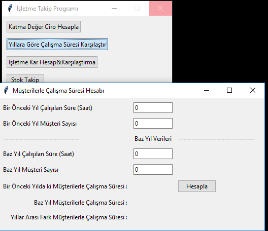
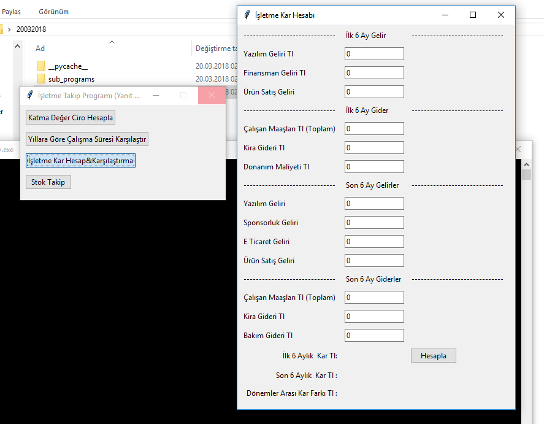
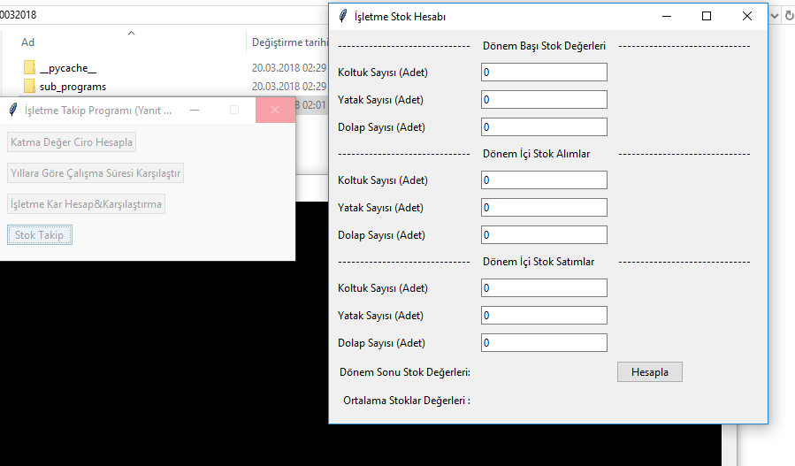

# Ybs2008
programlama 1 -python 3.6.4-
<h2># 20 Mart 2018</h2>
*20.03.2018 teslimli ödev Oluşturuldu, 
* Mvc,subprocress ve  tkinter gui kullanılarak tasarlandı  
* subPrograms/Views tkinter la olusturulmus gui classları
* subPrograms/Controllers herbir sayfa için mantıksal kodları içerir

<h2># 08 Mart 2018</h2>
python 2.7 sürümü için python2.7-04032018.zip  eklendi bu dosya üzerinden açılmama hatası giderildi. 
* import tkinter try fonksiyonu kullanılarak 2.7 uyumluluğu eklendi  
* Türkçe karakterler uyumluluk için kaldırıldı

<h2># 04 Mart 2018</h2>
04032018 dosyası ödev tarihini belirtmek için oluşturulmuştur, ödev GUİ olarak tasarlanmıştır. 04032018/isletme Takip programı.py dosyası çatı programdır,
kar hesabı,OEE,Adam Başı Ciro alt programlarını açan butonları içerir.

04032018/sub_programs klasörü Gui olarak tasarlanmış ödevleri içerir.

